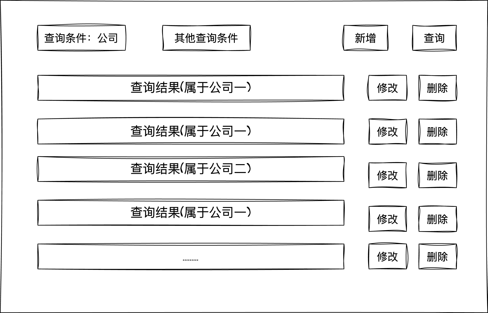

## 需求分析




提供一个http服务，该服务提供以下功能：

+ 对用户类型一（对应图中公司一）进行增删改查
+ 对用户类型二（对应图中公司二）进行增删改查
+ 根据http请求参数中公司参数操作不同类型用户


本例子用一个单体服务实现。


## 接口设计

1. /usermgt/add  添加用户，除了id，字段全量下发

   ```json
   {
     "company":1,
     "userCompanyOne":{...},
     "userCompanyTwo":{...}                  
   }
   ```
2. /usermgt/del  删除用户，下发ID

   ```
   {
     "company":2,
     "userCompanyOne":{...},
     "userCompanyTwo":{...}                  
   }
   ```
3. /usermgt/upd  更新用户，字段全量下发

   ```json
   {
     "company":1,
     "userCompanyOne":{...},
     "userCompanyTwo":{...}                  
   }
   ```
4. /usermgt/getByCompany 获取公司用户

   ```json
   {
     "company":1
   }
   ```

5. /usermgt/getByID 获取某个用户信息

   ```json
   {
     "company":1,
     "id":1
   }
   ```

   

## 表设计

公司一的用户表 user_company_one

```sql
DROP TABLE IF EXISTS user_company_one;
CREATE TABLE user_company_one(
    `id` INT NOT NULL AUTO_INCREMENT  COMMENT '用户id' ,
    `name` VARCHAR(255) NOT NULL   COMMENT '用户名称' ,
    `special1` VARCHAR(255)    COMMENT '专用字段1' ,
    `special2` VARCHAR(255)    COMMENT '专用字段2' ,
    `special3` VARCHAR(255)    COMMENT '专用字段3' ,
    `special4` VARCHAR(255)    COMMENT '专用字段4' ,
    PRIMARY KEY (id)
)  COMMENT = 'user_company_one';
```

公司二的用户表 user_company_two

```sql
DROP TABLE IF EXISTS user_company_two;
CREATE TABLE user_company_two(
    `id` INT NOT NULL AUTO_INCREMENT  COMMENT '用户id' ,
    `name` VARCHAR(255) NOT NULL   COMMENT '用户名称' ,
    `special1` VARCHAR(255)    COMMENT '专用字段1' ,
    `special2` VARCHAR(255)    COMMENT '专用字段2' ,
    PRIMARY KEY (id)
)  COMMENT = 'user_company_two';
```


## 服务设计

**目录层级结构**

参考 [webook](https://github.com/rui-cs/webook)


+ web ：路由转发

+ service : 这个服务的业务逻辑

+ repository ：操作领域对象domain。在例子中是很薄的一层，业务复杂后会显示出用处，在这一层对数据进行操作，如数据的转换等。

+ dao：对应dao文件夹，这一层直接操作数据库，执行crud、事务等


## 对比

repository这一层看起来很薄，如果删掉这一层会如何？

如果没有repository这一层，service层会直接调用dao层，也会直接操作领域数据。这样service层需要保存领域数据，职责就不够清晰了。

领域数据和dao层数据往往需要转换，添加repository层，封装对领域数据的操作，保存领域数据。层次和职责会更清晰。

删掉示例在[test分支](https://github.com/rui-cs/architecture-learning/tree/test)，示例中为了使代码清楚一点，还加了一些interface抽象domain和dao层的数据，反而使复杂度增加，还是不太清楚。

注意：无repository层的示例代码的get接口有bug，未进行调试。其余四个接口ok。


## 测试

测试结果见test文件夹


## 优点及适用场景

优点

+ 可读性：高。层级清晰，各司其职
+ 可维护性：高。因为层级清晰，所以出bug时很容易定位问题。
+ 可扩展性：高。层级扩展性高。如果添加其他公司用户，则增加新的repository、domain、dao，然后在service的company判断中增加判断即可。如果是添加其他服务，新增web、service、repository、domain、dao

适用场景

+ 类似于需求分析中的业务场景
+ 如果只有一种领域对象且后续无需扩展时也可不分层次简单处理


## 缘起

每一个程序员第一份业务代码可能都是CRUD，CRUD虽简单、烂大街，但是能不能把CRUD写得更好？写得更漂亮？写CRUD是否有规律可言？

有了这种想法，就想把对CRUD的经验落到纸面，沉淀下来。以后写CRUD效率更高啦，可以用更多时间做其他更有意义的事情。

这个模板例子，是一个最基本的业务服务例子，包含了需求分析、后台（接口、表、服务）部分的设计，测试结果，涵盖基本研发流程。


